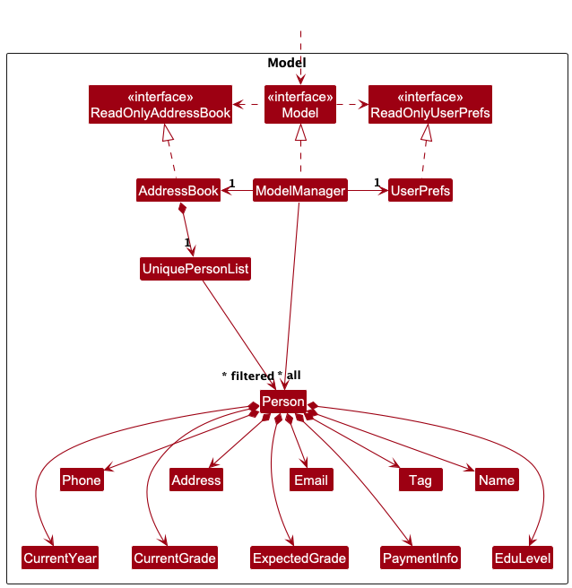
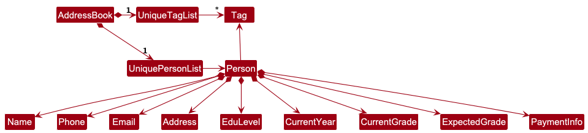

- Table of Contents
  {:toc}

---

## **Acknowledgements**

- This project is based on the [AddressBook-Level3 project](https://github.com/se-edu/addressbook-level3) created by the [SE-EDU initiative](https://se-education.org).
- `ColorUtil:isLightColor` is slightly adopted from the **StackOverflow** discussions [here](https://stackoverflow.com/a/14714716).
- {list here sources of all reused/adapted ideas, code, documentation, and third-party libraries -- include links to the original source as well}

---

## **Setting up, getting started**

Refer to the guide [_Setting up and getting started_](SettingUp.md).

---

## **Design**

:bulb: **Tip:** The `.puml` files used to create diagrams in this document `docs/diagrams` folder. Refer to the [_PlantUML Tutorial_ at se-edu/guides](https://se-education.org/guides/tutorials/plantUml.html) to learn how to create and edit diagrams.

### Architecture

The **_Architecture Diagram_** given above explains the high-level design of the App.

Given below is a quick overview of main components and how they interact with each other.

**Main components of the architecture**

**`Main`** (consisting of classes [`Main`](https://github.com/se-edu/addressbook-level3/tree/master/src/main/java/seedu/address/Main.java) and [`MainApp`](https://github.com/se-edu/addressbook-level3/tree/master/src/main/java/seedu/address/MainApp.java)) is in charge of the app launch and shut down.

- At app launch, it initializes the other components in the correct sequence, and connects them up with each other.
- At shut down, it shuts down the other components and invokes cleanup methods where necessary.

The bulk of the app's work is done by the following four components:

- [**`UI`**](#ui-component): The UI of the App.
- [**`Logic`**](#logic-component): The command executor.
- [**`Model`**](#model-component): Holds the data of the App in memory.
- [**`Storage`**](#storage-component): Reads data from, and writes data to, the hard disk.

[**`Commons`**](#common-classes) represents a collection of classes used by multiple other components.

**How the architecture components interact with each other**

The _Sequence Diagram_ below shows how the components interact with each other for the scenario where the user issues the command `delete 1`.

Each of the four main components (also shown in the diagram above),

- defines its _API_ in an `interface` with the same name as the Component.
- implements its functionality using a concrete `{Component Name}Manager` class (which follows the corresponding API `interface` mentioned in the previous point.

For example, the `Logic` component defines its API in the `Logic.java` interface and implements its functionality using the `LogicManager.java` class which follows the `Logic` interface. Other components interact with a given component through its interface rather than the concrete class (reason: to prevent outside component's being coupled to the implementation of a component), as illustrated in the (partial) class diagram below.

The sections below give more details of each component.

### UI component

The **API** of this component is specified in [`Ui.java`](https://github.com/se-edu/addressbook-level3/tree/master/src/main/java/seedu/address/ui/Ui.java)

The UI consists of a `MainWindow` that is made up of parts e.g.`CommandBox`, `ResultDisplay`, `PersonListPanel`, `StatusBarFooter` etc. All these, including the `MainWindow`, inherit from the abstract `UiPart` class which captures the commonalities between classes that represent parts of the visible GUI.

The `UI` component uses the JavaFx UI framework. The layout of these UI parts are defined in matching `.fxml` files that are in the `src/main/resources/view` folder. For example, the layout of the [`MainWindow`](https://github.com/se-edu/addressbook-level3/tree/master/src/main/java/seedu/address/ui/MainWindow.java) is specified in [`MainWindow.fxml`](https://github.com/se-edu/addressbook-level3/tree/master/src/main/resources/view/MainWindow.fxml)

The `UI` component,

- executes user commands using the `Logic` component.
- listens for changes to `Model` data so that the UI can be updated with the modified data.
- keeps a reference to the `Logic` component, because the `UI` relies on the `Logic` to execute commands.
- depends on some classes in the `Model` component, as it displays `Person` object residing in the `Model`.

### Logic component

**API** : [`Logic.java`](https://github.com/se-edu/addressbook-level3/tree/master/src/main/java/seedu/address/logic/Logic.java)

Here's a (partial) class diagram of the `Logic` component:

The sequence diagram below illustrates the interactions within the `Logic` component, taking `execute("delete 1")` API call as an example.

:information_source: **Note:** The lifeline for `DeleteCommandParser` should end at the destroy marker (X) but due to a limitation of PlantUML, the lifeline continues till the end of diagram.

How the `Logic` component works:

1. When `Logic` is called upon to execute a command, it is passed to an `AddressBookParser` object which in turn creates a parser that matches the command (e.g., `DeleteCommandParser`) and uses it to parse the command.
1. This results in a `Command` object (more precisely, an object of one of its subclasses e.g., `DeleteCommand`) which is executed by the `LogicManager`.
1. The command can communicate with the `Model` when it is executed (e.g. to delete a person). 
   Note that although this is shown as a single step in the diagram above (for simplicity), in the code it can take several interactions (between the command object and the `Model`) to achieve.
1. The result of the command execution is encapsulated as a `CommandResult` object which is returned back from `Logic`.

Here are the other classes in `Logic` (omitted from the class diagram above) that are used for parsing a user command:

How the parsing works:

- When called upon to parse a user command, the `AddressBookParser` class creates an `XYZCommandParser` (`XYZ` is a placeholder for the specific command name e.g., `AddCommandParser`) which uses the other classes shown above to parse the user command and create a `XYZCommand` object (e.g., `AddCommand`) which the `AddressBookParser` returns back as a `Command` object.
- All `XYZCommandParser` classes (e.g., `AddCommandParser`, `DeleteCommandParser`, ...) inherit from the `Parser` interface so that they can be treated similarly where possible e.g, during testing.

### Model component

**API** : [`Model.java`](https://github.com/se-edu/addressbook-level3/tree/master/src/main/java/seedu/address/model/Model.java)

The `Model` component,

- stores the address book data i.e., all `Person` objects (which are contained in a `UniquePersonList` object).
- stores the currently 'selected' `Person` objects (e.g., results of a search query) as a separate _filtered_ list which is exposed to outsiders as an unmodifiable `ObservableList<Person>` that can be 'observed' e.g. the UI can be bound to this list so that the UI automatically updates when the data in the list change.
- stores a `UserPref` object that represents the user’s preferences. This is exposed to the outside as a `ReadOnlyUserPref` objects.
- does not depend on any of the other three components (as the `Model` represents data entities of the domain, they should make sense on their own without depending on other components)

:information_source: **Note:** An alternative (arguably, a more OOP) model is given below. It has a `Tag` list in the `AddressBook`, which `Person` references. This allows `AddressBook` to only require one `Tag` object per unique tag, instead of each `Person` needing their own `Tag` objects. 

### Storage component

**API** : [`Storage.java`](https://github.com/se-edu/addressbook-level3/tree/master/src/main/java/seedu/address/storage/Storage.java)

The `Storage` component,

- can save both address book data and user preference data in JSON format, and read them back into corresponding objects.
- inherits from both `AddressBookStorage` and `UserPrefStorage`, which means it can be treated as either one (if only the functionality of only one is needed).
- depends on some classes in the `Model` component (because the `Storage` component's job is to save/retrieve objects that belong to the `Model`)

### Common classes

Classes used by multiple components are in the `seedu.address.commons` package.

---

## **Implementation**

This section describes some noteworthy details on how certain features are implemented.

### `Payment` command feature
The following diagram shows the interaction flow for the command — `payment 1 f/1000`. This updates the payment information for a person at the given index with the specified fee.

:information_source: **Note:** The lifeline for `PaymentCommandParser` should end at the destroy marker (X) but due to a limitation of PlantUML, the lifeline continues till the end of diagram.

### `Sort` Command Feature

The following diagram shows the interaction flow for the command — `sort`. This sorts the names in the list alphabetically.
<puml src="diagrams/SortCommandSequence.puml" width="550" />

:information_source: **Note:** The lifeline for `SortCommandParser` should end at the destroy marker (X) but due to a limitation of PlantUML, the lifeline continues till the end of diagram.

## **Documentation, logging, testing, configuration, dev-ops**

- [Documentation guide](Documentation.md)
- [Testing guide](Testing.md)
- [Logging guide](Logging.md)
- [Configuration guide](Configuration.md)
- [DevOps guide](DevOps.md)

---

## **Appendix: Requirements**

### Product scope

**Target user profile**:

- has a need to manage a significant number of student contacts
- prefer desktop apps over other types
- can type fast
- prefers typing to mouse interactions
- is reasonably comfortable using CLI apps
- independent tutors and coaching professionals who are tech-savvy

**Value proposition**: Helps tutors organize student contacts and track their progress, reducing administrative work and improving learning outcomes

### User stories

Priorities: High (must have) - `* * *`, Medium (nice to have) - `* *`, Low (unlikely to have) - `*`

| Priority | As a …                    | I want to …                                           | So that I can…                                                                            |
| -------- | ------------------------- | ----------------------------------------------------- | ----------------------------------------------------------------------------------------- |
| `* * *`  | Tutor (Beginner User)     | Add student information                               | Have all necessary student info in one place.                                             |
| `* * *`  | Tutor (Beginner User)     | Delete student information                            | Remove outdated or incorrect records.                                                     |
| `* * *`  | Tutor (Beginner User)     | List all student information                          | Look through an organized overview of all my students for easy reference and management.  |
| `* *`    | Tutor (Beginner User)     | Search for student information by name                | Quickly retrieve student records that match the name.                                     |
| `* *`    | Tutor (Beginner User)     | Sort my student information when listing              | Organize and view student records sorted based on a specific field.                       |
| `* *`    | Tutor (Intermediate User) | Edit student information                              | Update incorrect records.                                                                 |
| `* *`    | Tutor (Intermediate User) | Tag students into groups                              | Easily manage students by group type.                                                     |
| `* * *`  | Tutor (Intermediate User) | Assign colors to groups                               | Visually differentiate student groups.                                                    |
| `* * *`  | Tutor (Intermediate User) | Be able to efficiently add or remove tag from student | Efficiently manage a student's tag without having to overwrite it instead.                |
| `* * *`  | Tutor (Intermediate User) | Be able to bulk remove ALL student information        | Efficiently wipe out student records onto a clean slate.                                  |
| `* *`    | Tutor (Intermediate User) | Be able to bulk remove certain tag from all students  | Efficiently clear outdated tags.                                                          |
| `* *`    | Tutor (Expert User)       | Perform bulk deletion of student information          | Efficiently clear outdated records and prepare for a new semester.                        |
| `* *`    | Tutor (Expert User)       | Record student payments                               | Keep track of payments received.                                                          |
| `* *`    | Tutor (Expert User)       | Update payment statuses                               | Know which students have outstanding fees.                                                |
| `* *`    | Tutor (Beginner User)     | Be able to change to Dark/Light mode                  | See certain assigned colors easier.                                                       |

### Use cases

:information_source: **Note:** For all use cases below, the **System** is the `TutorSynch` and the **Actor** is the `user` (a tutor), unless specified otherwise.

**Use case: UC01 - Add a new student**

Guarantees:

- The new student record is saved if successfully added.

**MSS**

1. User requests to add a new student with the necessary information.
2. TutorSynch adds the student's record.
3. TutorSynch shows the list of student records including the newly added.

   Use case ends.

**Extensions**

- 1a. TutorSynch detects that user did not provide all mandatory details of a person.

  - 1a1. TutorSynch shows an error message.
  - 1a2. TutorSynch terminates the add process.

    Use case ends.

- 1b. TutorSynch detects that user did not comply with required formatting for details of a person.

  - 1b1. TutorSynch shows an error message.
  - 1b2. TutorSynch terminates the add process.

    Use case ends.

**Use case: UC02 - Edit a student's information**

Preconditions:

- At least one student record exists in TutorSynch.
- User has identified the specific student to be edited.

Guarantees:

- The existing student record is updated if successfully edited.

**MSS**

1. User requests to edit a specific student, alongside the new details.
2. TutorSynch updates the relevant student record.
3. TutorSynch shows the list of student records including the newly updated.

   Use case ends.

**Extensions**

- 1a. TutorSynch detects that user enters an invalid student reference.

  - 1a1. TutorSynch shows an error message.
  - 1a2. TutorSynch terminates the edit process.

    Use case ends.

- 1b. TutorSynch detects that user did not comply with required formatting for details of a person.

  - 1b1. TutorSynch shows an error message.
  - 1b2. TutorSynch terminates the edit process.

    Use case ends.

**Use case: UC03 - Delete a student**

Preconditions:

- At least one student record exists in TutorSynch.
- User has identified the specific student to be deleted.

Guarantees:

- The targeting student record is removed if successfully deleted.

**MSS**

1. User requests to delete a specific student record.
2. TutorSynch deletes the specified student record.
3. TutorSynch shows the updated list of student records.

   Use case ends.

**Extensions**

- 1a. TutorSynch detects that user enters an invalid student reference.
  - 1a1. TutorSynch shows an error message.
  - 1a2. TutorSynch terminates the delete process.
    Use case ends.

**Use case: UC04 - List all students**

**MSS**

1. User requests to list all students records.
2. TutorSynch displays the full list of students with their information.

   Use case ends.

**Extensions**

- 1a. Student list is empty.

  - 1a1. TutorSynch informs the user of the empty list.

  Use case ends.

**Use case: UC05 - Record payment information for existing student**

Preconditions:

- At least one student record exists in TutorSynch.
- User has identified the specific student to update their payment information.

Guarantees:

- The existing student record is updated with payment information if successfully recorded.

**MSS**

1. User requests to record payment information for a specific student.
2. TutorSynch adds the payment information to the student's record.
3. TutorSynch shows the list of student records including the newly added payment information.

   Use case ends.

**Extensions**

- 1a. TutorSynch detects that user enters an invalid student reference.

  - 1a1. TutorSynch shows an error message.
  - 1a2. TutorSynch terminates the edit process.

    Use case ends.

- 1b. TutorSynch detects that user did not comply with required formatting for payment information of a person.

  - 1b1. TutorSynch shows an error message.
  - 1b2. TutorSynch terminates the edit process.

    Use case ends.

**Use case: UC06 - Bulk delete student records**

Preconditions:

- At least one student record exists in TutorSynch.

Guarantees:

- **ALL** existing student records will be removed.

**MSS**

1. User requests to perform a bulk deletion.
2. TutorSynch deletes **ALL** student records.
3. TutorSynch informs the user of the bulk deletion.

   Use case ends.

**Extensions**

- 2a. User chooses to cancel or deny the bulk deletion process.

  - 2a1. TutorSynch informs the user that no changes were made.
  - 2a2. TutorSynch terminates the bulk deletion process.

    Use case ends.

- 4a. User chooses to cancel or deny the bulk deletion process.

  - 4a1. TutorSynch informs the user that no changes were made.
  - 4a2. TutorSynch terminates the bulk deletion process.

    Use case ends.

**Use case: UC07 - Compare progress between two students**

Preconditions:

- At least two distinct student record exists in TutorSynch.
- User has identified the two specific students to compare between.

Guarantees:

- TutorSynch shows a basic side-by-side comparison of the two student's progress/grades.

**MSS**

1. User requests a comparison by specifying the two student.
2. TutorSynch displays the basic side-by-side comparison based on both student records.

   Use case ends.

**Extensions**

- 1a. TutorSynch detects one or both student references are invalid.

  - 1a1. TutorSynch shows an error message.
  - 1a2. TutorSynch terminates the comparison process.

    Use case ends.

  
**Use case: UC08 - Remove tags from all students**

**Preconditions:**
- At least one student must exist.
- Tags to remove are specified.

**Guarantees:**
- All occurrences of specified tags are removed from all student records.

**MSS**

1. User enters the `untag` command with one or more tags.
2. TutorSynch removes all occurrences of the specified tags from every student.
3. TutorSynch shows the updated student list reflecting tag removal.

**Extensions**

* 1a. No students have any of the specified tags.
    * 1a1. TutorSynch completes silently with no changes.
* 1b. Invalid tag formatting is detected.
  * 1b1. TutorSynch shows an error message.

**Use case: UC09 – Sort student list alphabetically**

**Guarantees:**

- Student list is displayed in alphabetical order by name.

**MSS**

1. User enters the sort command.
2. TutorSynch sorts the existing student list alphabetically.
3. TutorSynch displays the sorted list.

**Extensions**

* 1a. Student list is empty.
  * 1a1. TutorSynch shows a message indicating the list is empty.

**Use case: UC10 – Bulk delete using `clear` command by index range or tags**

**Preconditions:**

- At least one student exists.
- User provides either a valid index range or valid tags.

**Guarantees:**

- Student records in the given index range or with matching tags are permanently deleted.

**MSS**

1. User enters clear with either:
   1. a valid index range, or 
   2. one or more tags. 
2. TutorSynch validates input.
3. TutorSynch deletes matching students.
4. TutorSynch shows the updated student list.

**Extensions**

* 1a. Index range is invalid.
  * 1a1. TutorSynch shows an error message.
* 1b. No students match the given tags.
    * 1b1. TutorSynch displays a message indicating no students found.

### Non-Functional Requirements

1.  Should work on any _mainstream OS_ as long as it has Java `17` or above installed.
2.  Should be able to hold up to 1000 persons without a noticeable sluggishness in performance for typical usage.
3.  A user with above average typing speed for regular English text (i.e. not code, not system admin commands) should be able to accomplish most of the tasks faster using commands than using the mouse.
4.  Should be able to persist student records and payment status in local storage as JSON files.
5.  Any changes to the student records will result in an immediate update to the persistent local storage.
6.  Should be able to fall back to a safe state (empty state) given a corrupted or invalid JSON data.
7.  Response to any use action should be visible within 3 seconds.

### Glossary

- **Mainstream OS**: Windows, Linux, Unix, MacOS
- **CLI**: Command Line Interface; User interacts with the application by typing text commands rather than using a mouse.
- **Persist**: Student records should be saved to local storage (as JSON files) in a way that ensures they remain available even after the application is closed and reopened.

---

## **Appendix: Instructions for manual testing**

Given below are instructions to test the app manually.

:information_source: **Note:** These instructions only provide a starting point for testers to work on;
testers are expected to do more *exploratory* testing.

### Launch and shutdown

1. Initial launch

   1. Download the jar file and copy into an empty folder

   1. Double-click the jar file Expected: Shows the GUI with a set of sample contacts. The window size may not be optimum.

1. Saving window preferences

   1. Resize the window to an optimum size. Move the window to a different location. Close the window.

   1. Re-launch the app by double-clicking the jar file. 
      Expected: The most recent window size and location is retained.

1. _{ more test cases …​ }_

### Deleting a person

1. Deleting a person while all persons are being shown

   1. Prerequisites: List all persons using the `list` command. Multiple persons in the list.

   1. Test case: `delete 1` 
      Expected: First contact is deleted from the list. Details of the deleted contact shown in the status message. Timestamp in the status bar is updated.

   1. Test case: `delete 0` 
      Expected: No person is deleted. Error details shown in the status message. Status bar remains the same.

   1. Other incorrect delete commands to try: `delete`, `delete x`, `...` (where x is larger than the list size) 
      Expected: Similar to previous.

1. _{ more test cases …​ }_

### Saving data

1. Dealing with missing/corrupted data files

   1. _{explain how to simulate a missing/corrupted file, and the expected behavior}_

1. _{ more test cases …​ }_
