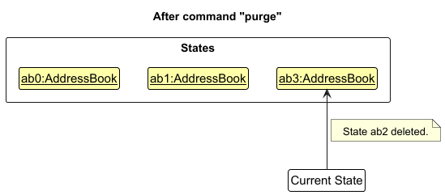

* Table of Contents
{:toc}

--------------------------------------------------------------------------------------------------------------------

## **Acknowledgements**

* This project is based on the [AddressBook-Level3 project](https://github.com/se-edu/addressbook-level3) created by the [SE-EDU initiative](https://se-education.org).
* `ColorUtil:isLightColor` is slightly adopted from the **StackOverflow** discussions [here](https://stackoverflow.com/a/14714716).
* {list here sources of all reused/adapted ideas, code, documentation, and third-party libraries -- include links to the original source as well}

--------------------------------------------------------------------------------------------------------------------

## **Setting up, getting started**

Refer to the guide [_Setting up and getting started_](SettingUp.md).

--------------------------------------------------------------------------------------------------------------------

## **Design**

:bulb: **Tip:** The `.puml` files used to create diagrams in this document `docs/diagrams` folder. Refer to the [_PlantUML Tutorial_ at se-edu/guides](https://se-education.org/guides/tutorials/plantUml.html) to learn how to create and edit diagrams.

### Architecture

The ***Architecture Diagram*** given above explains the high-level design of the App.

Given below is a quick overview of main components and how they interact with each other.

**Main components of the architecture**

**`Main`** (consisting of classes [`Main`](https://github.com/se-edu/addressbook-level3/tree/master/src/main/java/seedu/address/Main.java) and [`MainApp`](https://github.com/se-edu/addressbook-level3/tree/master/src/main/java/seedu/address/MainApp.java)) is in charge of the app launch and shut down.
* At app launch, it initializes the other components in the correct sequence, and connects them up with each other.
* At shut down, it shuts down the other components and invokes cleanup methods where necessary.

The bulk of the app's work is done by the following four components:

* [**`UI`**](#ui-component): The UI of the App.
* [**`Logic`**](#logic-component): The command executor.
* [**`Model`**](#model-component): Holds the data of the App in memory.
* [**`Storage`**](#storage-component): Reads data from, and writes data to, the hard disk.

[**`Commons`**](#common-classes) represents a collection of classes used by multiple other components.

**How the architecture components interact with each other**

The *Sequence Diagram* below shows how the components interact with each other for the scenario where the user issues the command `delete 1`.

Each of the four main components (also shown in the diagram above),

* defines its *API* in an `interface` with the same name as the Component.
* implements its functionality using a concrete `{Component Name}Manager` class (which follows the corresponding API `interface` mentioned in the previous point.

For example, the `Logic` component defines its API in the `Logic.java` interface and implements its functionality using the `LogicManager.java` class which follows the `Logic` interface. Other components interact with a given component through its interface rather than the concrete class (reason: to prevent outside component's being coupled to the implementation of a component), as illustrated in the (partial) class diagram below.

The sections below give more details of each component.

### UI component

The **API** of this component is specified in [`Ui.java`](https://github.com/se-edu/addressbook-level3/tree/master/src/main/java/seedu/address/ui/Ui.java)

The UI consists of a `MainWindow` that is made up of parts e.g.`CommandBox`, `ResultDisplay`, `PersonListPanel`, `StatusBarFooter` etc. All these, including the `MainWindow`, inherit from the abstract `UiPart` class which captures the commonalities between classes that represent parts of the visible GUI.

The `UI` component uses the JavaFx UI framework. The layout of these UI parts are defined in matching `.fxml` files that are in the `src/main/resources/view` folder. For example, the layout of the [`MainWindow`](https://github.com/se-edu/addressbook-level3/tree/master/src/main/java/seedu/address/ui/MainWindow.java) is specified in [`MainWindow.fxml`](https://github.com/se-edu/addressbook-level3/tree/master/src/main/resources/view/MainWindow.fxml)

The `UI` component,

* executes user commands using the `Logic` component.
* listens for changes to `Model` data so that the UI can be updated with the modified data.
* keeps a reference to the `Logic` component, because the `UI` relies on the `Logic` to execute commands.
* depends on some classes in the `Model` component, as it displays `Person` object residing in the `Model`.

### Logic component

**API** : [`Logic.java`](https://github.com/se-edu/addressbook-level3/tree/master/src/main/java/seedu/address/logic/Logic.java)

Here's a (partial) class diagram of the `Logic` component:

The sequence diagram below illustrates the interactions within the `Logic` component, taking `execute("delete 1")` API call as an example.

:information_source: **Note:** The lifeline for `DeleteCommandParser` should end at the destroy marker (X) but due to a limitation of PlantUML, the lifeline continues till the end of diagram.

How the `Logic` component works:

1. When `Logic` is called upon to execute a command, it is passed to an `AddressBookParser` object which in turn creates a parser that matches the command (e.g., `DeleteCommandParser`) and uses it to parse the command.
1. This results in a `Command` object (more precisely, an object of one of its subclasses e.g., `DeleteCommand`) which is executed by the `LogicManager`.
1. The command can communicate with the `Model` when it is executed (e.g. to delete a person). 
   Note that although this is shown as a single step in the diagram above (for simplicity), in the code it can take several interactions (between the command object and the `Model`) to achieve.
1. The result of the command execution is encapsulated as a `CommandResult` object which is returned back from `Logic`.

Here are the other classes in `Logic` (omitted from the class diagram above) that are used for parsing a user command:

How the parsing works:
* When called upon to parse a user command, the `AddressBookParser` class creates an `XYZCommandParser` (`XYZ` is a placeholder for the specific command name e.g., `AddCommandParser`) which uses the other classes shown above to parse the user command and create a `XYZCommand` object (e.g., `AddCommand`) which the `AddressBookParser` returns back as a `Command` object.
* All `XYZCommandParser` classes (e.g., `AddCommandParser`, `DeleteCommandParser`, ...) inherit from the `Parser` interface so that they can be treated similarly where possible e.g, during testing.

### Model component
**API** : [`Model.java`](https://github.com/se-edu/addressbook-level3/tree/master/src/main/java/seedu/address/model/Model.java)

The `Model` component,

* stores the address book data i.e., all `Person` objects (which are contained in a `UniquePersonList` object).
* stores the currently 'selected' `Person` objects (e.g., results of a search query) as a separate _filtered_ list which is exposed to outsiders as an unmodifiable `ObservableList<Person>` that can be 'observed' e.g. the UI can be bound to this list so that the UI automatically updates when the data in the list change.
* stores a `UserPref` object that represents the user’s preferences. This is exposed to the outside as a `ReadOnlyUserPref` objects.
* does not depend on any of the other three components (as the `Model` represents data entities of the domain, they should make sense on their own without depending on other components)

:information_source: **Note:** An alternative (arguably, a more OOP) model is given below. It has a `Tag` list in the `AddressBook`, which `Person` references. This allows `AddressBook` to only require one `Tag` object per unique tag, instead of each `Person` needing their own `Tag` objects. 

### Storage component

**API** : [`Storage.java`](https://github.com/se-edu/addressbook-level3/tree/master/src/main/java/seedu/address/storage/Storage.java)

The `Storage` component,
* can save both address book data and user preference data in JSON format, and read them back into corresponding objects.
* inherits from both `AddressBookStorage` and `UserPrefStorage`, which means it can be treated as either one (if only the functionality of only one is needed).
* depends on some classes in the `Model` component (because the `Storage` component's job is to save/retrieve objects that belong to the `Model`)

### Common classes

Classes used by multiple components are in the `seedu.address.commons` package.

--------------------------------------------------------------------------------------------------------------------

## **Implementation**

This section describes some noteworthy details on how certain features are implemented.

### \[Proposed\] Undo/redo feature

#### Proposed Implementation

The proposed undo/redo mechanism is facilitated by `VersionedAddressBook`. It extends `AddressBook` with an undo/redo history, stored internally as an `addressBookStateList` and `currentStatePointer`. Additionally, it implements the following operations:

* `VersionedAddressBook#commit()` — Saves the current address book state in its history.
* `VersionedAddressBook#undo()` — Restores the previous address book state from its history.
* `VersionedAddressBook#redo()` — Restores a previously undone address book state from its history.

These operations are exposed in the `Model` interface as `Model#commitAddressBook()`, `Model#undoAddressBook()` and `Model#redoAddressBook()` respectively.

Given below is an example usage scenario and how the undo/redo mechanism behaves at each step.

Step 1. The user launches the application for the first time. The `VersionedAddressBook` will be initialized with the initial address book state, and the `currentStatePointer` pointing to that single address book state.

Step 2. The user executes `delete 5` command to delete the 5th person in the address book. The `delete` command calls `Model#commitAddressBook()`, causing the modified state of the address book after the `delete 5` command executes to be saved in the `addressBookStateList`, and the `currentStatePointer` is shifted to the newly inserted address book state.

Step 3. The user executes `add n/David …​` to add a new person. The `add` command also calls `Model#commitAddressBook()`, causing another modified address book state to be saved into the `addressBookStateList`.

:information_source: **Note:** If a command fails its execution, it will not call `Model#commitAddressBook()`, so the address book state will not be saved into the `addressBookStateList`.

Step 4. The user now decides that adding the person was a mistake, and decides to undo that action by executing the `undo` command. The `undo` command will call `Model#undoAddressBook()`, which will shift the `currentStatePointer` once to the left, pointing it to the previous address book state, and restores the address book to that state.

:information_source: **Note:** If the `currentStatePointer` is at index 0, pointing to the initial AddressBook state, then there are no previous AddressBook states to restore. The `undo` command uses `Model#canUndoAddressBook()` to check if this is the case. If so, it will return an error to the user rather
than attempting to perform the undo.

The following sequence diagram shows how an undo operation goes through the `Logic` component:

:information_source: **Note:** The lifeline for `UndoCommand` should end at the destroy marker (X) but due to a limitation of PlantUML, the lifeline reaches the end of diagram.

Similarly, how an undo operation goes through the `Model` component is shown below:

The `redo` command does the opposite — it calls `Model#redoAddressBook()`, which shifts the `currentStatePointer` once to the right, pointing to the previously undone state, and restores the address book to that state.

:information_source: **Note:** If the `currentStatePointer` is at index `addressBookStateList.size() - 1`, pointing to the latest address book state, then there are no undone AddressBook states to restore. The `redo` command uses `Model#canRedoAddressBook()` to check if this is the case. If so, it will return an error to the user rather than attempting to perform the redo.

Step 5. The user then decides to execute the command `list`. Commands that do not modify the address book, such as `list`, will usually not call `Model#commitAddressBook()`, `Model#undoAddressBook()` or `Model#redoAddressBook()`. Thus, the `addressBookStateList` remains unchanged.

Step 6. The user executes `purge`, which calls `Model#commitAddressBook()`. Since the `currentStatePointer` is not pointing at the end of the `addressBookStateList`, all address book states after the `currentStatePointer` will be purged. Reason: It no longer makes sense to redo the `add n/David …​` command. This is the behavior that most modern desktop applications follow.

The following activity diagram summarizes what happens when a user executes a new command:

#### Design considerations:

**Aspect: How undo & redo executes:**

* **Alternative 1 (current choice):** Saves the entire address book.
  * Pros: Easy to implement.
  * Cons: May have performance issues in terms of memory usage.

* **Alternative 2:** Individual command knows how to undo/redo by
  itself.
  * Pros: Will use less memory (e.g. for `delete`, just save the person being deleted).
  * Cons: We must ensure that the implementation of each individual command are correct.

_{more aspects and alternatives to be added}_

### \[Proposed\] Data archiving

_{Explain here how the data archiving feature will be implemented}_

--------------------------------------------------------------------------------------------------------------------

## **Documentation, logging, testing, configuration, dev-ops**

* [Documentation guide](Documentation.md)
* [Testing guide](Testing.md)
* [Logging guide](Logging.md)
* [Configuration guide](Configuration.md)
* [DevOps guide](DevOps.md)

--------------------------------------------------------------------------------------------------------------------

## **Appendix: Requirements**

### Product scope

**Target user profile**:

* has a need to manage a significant number of student contacts
* prefer desktop apps over other types
* can type fast
* prefers typing to mouse interactions
* is reasonably comfortable using CLI apps
* independent tutors and coaching professionals who are tech-savvy

**Value proposition**: Helps tutors organize student contacts and track their progress, reducing administrative work and improving learning outcomes

### User stories

Priorities: High (must have) - `* * *`, Medium (nice to have) - `* *`, Low (unlikely to have) - `*`

| Priority | As a …                    | I want to …                                           | So that I can…                                                                            |
|----------|---------------------------|-------------------------------------------------------|-------------------------------------------------------------------------------------------|
| `* * *`  | Tutor (Beginner User)     | Add student information                               | Have all necessary student info in one place.                                             |
| `* * *`  | Tutor (Beginner User)     | Delete student information                            | Remove outdated or incorrect records.                                                     |
| `* * *`  | Tutor (Beginner User)     | List all student information                          | Look through an organized overview of all my students for easy reference and management.  |
| `* *`    | Tutor (Beginner User)     | Search for student information by name                | Quickly retrieve student records that match the name.                                     |
| `* *`    | Tutor (Beginner User)     | Sort my student information when listing              | Organize and view student records sorted based on a specific field.                       |
| `* *`    | Tutor (Intermediate User) | Edit student information                              | Update incorrect records.                                                                 |
| `* *`    | Tutor (Intermediate User) | Tag students into groups                              | Easily manage students by group type.                                                     |
| `* * *`  | Tutor (Intermediate User) | Assign colors to groups                               | Visually differentiate student groups.                                                    |
| `* * *`  | Tutor (Intermediate User) | Be able to efficiently add or remove tag from student | Efficiently manage a student's tag without having to overwrite it instead.                |
| `* * *`  | Tutor (Intermediate User) | Be able to bulk remove ALL student information        | Efficiently wipe out student records onto a clean slate.                                  |
| `* *`    | Tutor (Intermediate User) | Be able to bulk remove certain tag from all students  | Efficiently clear outdated tags.                                                          |
| `* *`    | Tutor (Expert User)       | Categorise student information                        | Better retrieve and organize relevant student data.                                       |
| `* *`    | Tutor (Expert User)       | Compare student progress                              | Tailor lessons to individual needs.                                                       |
| `* *`    | Tutor (Expert User)       | Perform bulk deletion of student information          | Efficiently clear outdated records and prepare for a new semester.                        |
| `* *`    | Tutor (Expert User)       | Record student payments                               | Keep track of payments received.                                                          |
| `* *`    | Tutor (Expert User)       | Update payment statuses                               | Know which students have outstanding fees.                                                |
| `*`      | Tutor (Expert User)       | Export filtered views                                 | Save and share specific student data for analysis, reporting, or administrative purposes. |
| `*`      | Tutor (Expert User)       | Filter students by criteria                           | Quickly find relevant students.                                                           |
| `*`      | Tutor (Expert User)       | Generate payment summaries                            | Have a quick overview of all payments.                                                    |
| `*`      | Tutor (Expert User)       | Generate student progress reports                     | Share insights with students or parents.                                                  |
| `*`      | Tutor (Expert User)       | Perform conditional deletion of student information   | Efficiently clear out specific groups of student records.                                 |
| `*`      | Tutor (Expert User)       | View student performance trends                       | Assess their progress over time.                                                          |
| `*`      | Tutor (Beginner User)     | Be able to change to Dark/Light mode                  | See certain assigned colors easier.                                                       |

### Use cases

:information_source: **Note:** For all use cases below, the **System** is the `TutorSynch` and the **Actor** is the `user` (a tutor), unless specified otherwise.

**Use case: UC01 - Add a new student**

Guarantees:
* The new student record is saved if successfully added.

**MSS**

1. User requests to add a new student with the necessary information.
2. TutorSynch adds the student's record.
3. TutorSynch shows the list of student records including the newly added.

    Use case ends.

**Extensions**

* 1a. TutorSynch detects that user did not provide all mandatory details of a person.
  * 1a1. TutorSynch shows an error message.
  * 1a2. TutorSynch terminates the add process.

    Use case ends.

* 1b. TutorSynch detects that user did not comply with required formatting for details of a person.
  * 1b1. TutorSynch shows an error message.
  * 1b2. TutorSynch terminates the add process.

    Use case ends.

**Use case: UC02 - Edit a student's information**

Preconditions:
* At least one student record exists in TutorSynch.
* User has identified the specific student to be edited.

Guarantees:
* The existing student record is updated if successfully edited.

**MSS**

1. User requests to edit a specific student, alongside the new details.
2. TutorSynch updates the relevant student record.
3. TutorSynch shows the list of student records including the newly updated.

   Use case ends.

**Extensions**

* 1a. TutorSynch detects that user enters an invalid student reference.
  * 1a1. TutorSynch shows an error message.
  * 1a2. TutorSynch terminates the edit process.

    Use case ends.

* 1b. TutorSynch detects that user did not comply with required formatting for details of a person.
  * 1b1. TutorSynch shows an error message.
  * 1b2. TutorSynch terminates the edit process.

    Use case ends.

**Use case: UC03 - Delete a student**

Preconditions:
* At least one student record exists in TutorSynch.
* User has identified the specific student to be deleted.

Guarantees:
* The targeting student record is removed if successfully deleted.

**MSS**

1. User requests to delete a specific student record.
2. TutorSynch deletes the specified student record.
3. TutorSynch shows the updated list of student records.

    Use case ends.

**Extensions**

* 1a. TutorSynch detects that user enters an invalid student reference.
  * 1a1. TutorSynch shows an error message.
  * 1a2. TutorSynch terminates the delete process.
      
    Use case ends.

**Use case: UC04 - List all students**

**MSS**
1. User requests to list all students records.
2. TutorSynch displays the full list of students with their information.

   Use case ends.

**Extensions**

* 1a. Student list is empty.
  * 1a1. TutorSynch informs the user of the empty list.
  
   Use case ends.

**Use case: UC05 - Record payment information for existing student**

Preconditions:
* At least one student record exists in TutorSynch.
* User has identified the specific student to update their payment information.

Guarantees:
* The existing student record is updated with payment information if successfully recorded.

**MSS**
1. User requests to record payment information for a specific student.
2. TutorSynch adds the payment information to the student's record.
3. TutorSynch shows the list of student records including the newly added payment information.

   Use case ends.

**Extensions**

* 1a. TutorSynch detects that user enters an invalid student reference.
  * 1a1. TutorSynch shows an error message.
  * 1a2. TutorSynch terminates the edit process.

    Use case ends.

* 1b. TutorSynch detects that user did not comply with required formatting for payment information of a person.
  * 1b1. TutorSynch shows an error message.
  * 1b2. TutorSynch terminates the edit process.

    Use case ends.

**Use case: UC06 - Bulk delete student records**

Preconditions:
* At least one student record exists in TutorSynch.

Guarantees:
* **ALL** existing student records will be removed.

**MSS**
1. User requests to perform a bulk deletion.
2. TutorSynch requests for confirmation.
3. User confirms.
4. TutorSynch requests for a second confirmation.
5. User confirms.
6. TutorSynch deletes **ALL** student records.
7. TutorSynch informs the user of the bulk deletion.

   Use case ends.

**Extensions**

* 2a. User chooses to cancel or deny the bulk deletion process.
  * 2a1. TutorSynch informs the user that no changes were made.
  * 2a2. TutorSynch terminates the bulk deletion process.

    Use case ends.

* 4a. User chooses to cancel or deny the bulk deletion process.
  * 4a1. TutorSynch informs the user that no changes were made.
  * 4a2. TutorSynch terminates the bulk deletion process.

    Use case ends.

**Use case: UC07 - Compare progress between two students**

Preconditions:
* At least two distinct student record exists in TutorSynch.
* User has identified the two specific students to compare between.

Guarantees:
* TutorSynch shows a basic side-by-side comparison of the two student's progress/grades.

**MSS**
1. User requests a comparison by specifying the two student.
3. TutorSynch displays the basic side-by-side comparison based on both student records.

   Use case ends.

**Extensions**

* 1a. TutorSynch detects one or both student references are invalid.
    * 1a1. TutorSynch shows an error message.
    * 1a2. TutorSynch terminates the comparison process.

      Use case ends.

### Non-Functional Requirements

1.  Should work on any _mainstream OS_ as long as it has Java `17` or above installed.
2.  Should be able to hold up to 1000 persons without a noticeable sluggishness in performance for typical usage.
3.  A user with above average typing speed for regular English text (i.e. not code, not system admin commands) should be able to accomplish most of the tasks faster using commands than using the mouse.
4.  Should be able to persist student records and payment status in local storage as JSON files.
5.  Any changes to the student records will result in an immediate update to the persistent local storage.
6.  Should be able to fall back to a safe state (empty state) given a corrupted or invalid JSON data.
7.  Response to any use action should be visible within 3 seconds.

### Glossary

* **Mainstream OS**: Windows, Linux, Unix, MacOS
* **CLI**: Command Line Interface; User interacts with the application by typing text commands rather than using a mouse.
* **Persist**: Student records should be saved to local storage (as JSON files) in a way that ensures they remain available even after the application is closed and reopened.

--------------------------------------------------------------------------------------------------------------------

## **Appendix: Instructions for manual testing**

Given below are instructions to test the app manually.

:information_source: **Note:** These instructions only provide a starting point for testers to work on; testers are expected to do more *exploratory* testing.

### Launch and shutdown

1. Initial launch

    1. Download the jar file and copy into an empty folder

    2. Double-click the jar file. 
       **Expected**: Shows the GUI with a set of sample contacts. The window size may not be optimum.

2. Saving window preferences

    1. Resize the window to an optimum size. Move the window to a different location. Close the window.

    2. Re-launch the app by double-clicking the jar file. 
       **Expected**: The most recent window size and location is retained.

3. Launching multiple instances of the app

    1. The application is not designed to run with multiple parallel instances. 
       **Expected**: Race condition will cause behaviour of the application and updates to file storage to be unpredictable since the application only reads the storage file once upon start-up, only writing to the storage file when there are changes to the in-memory data.

### Data Storage

1. Launching app with missing data file

    1. **Prerequisites**: Delete or rename the JSON file for student records and/or the parent directory before launching the app.

    2. **Test case**: Double-click the jar file to launch the app. 
       **Expected**: App detects the missing data file and/or directory and starts with a default list of persons. Only upon making changes to this list will the directory and/or JSON file be created.

2. Launching app with corrupted data file

    1. **Prerequisites**: Modify the JSON file for student records to contain invalid or corrupted data.

    2. **Test case**: Double-click the jar file to launch the app. 
       **Expected**: App detects the corrupted data file and falls back to an empty state. A message is displayed notifying the user about the corrupted data and the fallback in the command line interface.

3. App shutdown with unsaved changes

    1. **Prerequisites**: Launch the app and make changes to student records (e.g., add or modify a student's information).

    2. **Test case**: Close the app and relaunch the jar. 
       **Expected**: Changes are automatically persisted to the JSON file before shutdown without additional prompts to save.

### Deleting a person

1. Deleting a person while all persons are being shown

    1. **Prerequisites**: List all persons using the `list` command. Multiple persons in the list.

    2. **Test case**: `delete 1` 
       **Expected**: First contact is deleted from the list. Details of the deleted contact are shown.

    3. **Test case**: `delete 0` 
       **Expected**: No person is deleted. Error details shown in the status message.

    4. Other incorrect delete commands to try: `delete`, `delete x`, `...` (where x is larger than the list size) 
       **Expected**: Similar to previous.

2. Deleting a person while only partial list is shown

    1. **Prerequisites**: Filter the list using a relevant search command (e.g., `find Alex`).

    2. **Test case**: `delete 1` 
       **Expected**: First contact in the filtered list is deleted. Details of the deleted contact are displayed, and the filtered list is updated automatically to reflect the change.

    3. **Test case**: `delete 0` 
       **Expected**: No person is deleted. Error details are shown.

    4. Other incorrect delete commands to try: `delete`, `delete x`, `...` (where x is larger than the filtered list
       size) 
       **Expected**: Similar to previous cases; error messages are displayed, and the list remains unchanged.

### Adding a person

1. Adding a person without optional fields
    1. **Test case**: `add n/Jane Doe p/87654321 e/jane.doe@example.com a/90 Stevens Road` 
       **Expected**: New contact is added to the list. Details of the newly added contact are displayed. Contact list grows by one.

    2. **Test case**: `add` with leading and trailing whitespaces in the fields. 
       Example: `  add   n/ Jane Doe   p/  87654321 e/  jane.doe@example.com   a/  90 Stevens Road ` 
       **Expected**: All leading and trailing spaces are ignored (includes spaces immediately after the prefixes). New contact is added to the list. Details of the newly added contact are displayed. Contact list grows by one.

    3. **Test case**: `add` with missing mandatory parameters name, address, phone number and email. 
       **Expected**: Appropriate error message is displayed for the first missing parameter. Contact is not added.

    4. **Test case**: `add` with mandatory prefixes but empty fields.  
       Example: `add n/ p/ e/ a/` 
       **Expected**: Appropriate error message is displayed for the first empty field. Contact is not added.

    5. **Test case**: `add` with invalid data formats for mandatory parameters. (e.g., invalid email, non-numeric phone number) 
       **Expected**: Appropriate error message is displayed for the first invalid field. Contact is not added.

2. Adding a person with optional fields.
    1. **Test case**: `add n/James Ho p/22224444 e/jamesho@example.com a/123, Clementi Rd, 1234665 cg/D eg/A l/Primary cy/P2 t/CS2030C t/friends` 
       **Expected**: New contact is added to the list. Details of the newly added contact are displayed. Contact list grows by one.

    2. **Test case**: `add` with optional prefixes but empty fields. 
       Example: `add n/James Ho p/22224444 e/jamesho@example.com a/123, Clementi Rd, 1234665 cg/ eg/ l/ cy/ t/` 
       **Expected**: Appropriate error message is displayed for the first empty field. Contact is not added.
    3. **Test case**: `add` with invalid data formats for optional fields. (e.g., too many tags, invalid color code for tags, invalid grades, etc.) 
       **Expected**: Appropriate error message is displayed for the first empty field. Contact is not added.

### Editing a person

1. Editing the mandatory fields of a person in the list (as with delete, the index depends on the list that is currently shown).
    1. **Prerequisites**: Ensure there is at least one contact in the list.
    2. **Test case**: `edit 1 p/98765432` 
       **Expected**: Phone number of the first contact is updated. Details of the edited contact are shown.
    3. **Test case**: `edit` with a nonexistent index (e.g., `edit 0` or `edit x`, where x is larger than the list size) 
       **Expected**: No changes made to the list. An appropriate error message is displayed.
    4. **Test case**: `edit 1` with missing or invalid parameters (e.g., `edit 1 p/`) 
       **Expected**: No changes made. An error message is displayed for the first incomplete or invalid parameter.
2. Editing the optional fields of a person in the list.
    1. **Prerequisites**: Ensure there is at least one contact in the list.
    2. **Test case**: `edit 1 cg/A` 
       **Expected**: Grade of the first contact is updated. Details of the edited contact are shown.
    3. **Test case**: `edit 1` with missing parameters (e.g., `edit 1 cg/`) 
       **Expected**: The optional field is cleared from the contact. Updated contact is shown.
    4. **Test case**: `edit 1` with invalid optional parameters (e.g., `edit 1 cg/INVALIDGRADE`) 
       **Expected**: No changes made. An error message is displayed for the first invalid parameter.
    5. **Test case**: `edit` with a nonexistent index (e.g., `edit 0` or `edit x`, where x is larger than the list size) 
       **Expected**: No changes made to the list. An appropriate error message is displayed.
3. Editing tags for a person in the list.
    1. **Prerequisites**: Ensure there is at least one contact in the list. Run this command to ensure the first person has the required tags: `edit 1 t/abc t/def.`
       1Note: **Expected** cases assumes that each test case is run in order.
    2. **Test case**: `edit 1 t+/one t+/two` 
       **Expected**: First contact in the list should have two tags added as such: `abc`, `def`, `one`, `two`.
    3. **Test case**: `edit 1 t-/abc t-/def` 
       **Expected**: First contact in the list should have two tags removed as such: `one`, `two`.
    4. **Test case**: `edit 1 t+/three t-/two` 
       **Expected**: First contact in the list should be updated to have the following tags: `one`, `three`.
    5. **Test case**: `edit 1 t+/two t-/None` 
       **Expected**: First contact in the list should have a tag added. When removing tags, if tag does not exist, no error is thrown. First contact should now have tags: `one`, `two`, `three`.
    6. **Test case**: `edit 1 t/abc t/def` 
       **Expected**: Clears all tags from the first contact and replace with specified tags resulting in the following tags: `abc`, `def`
    7. **Test case**: `edit 1 t/one t+/two t-/two t-/one`
       **Expected**: Clears all tags and replaces it with the tag set prefixed by `t/`, adds all tags in the tag set prefixed by `t+/`, removes all tags in from the tag set prefixed by `t-/` resulting in no tags.

### Purging all contacts
1. Purging contacts while contacts are in the list
    1. **Prerequisites**: Ensure there are multiple contacts in the current list.
    2. **Test case**: Run the command `purge`. 
       **Expected**: All contacts are deleted, and a message confirms the list is cleared. The contact list becomes empty.
    3. **Test case**: Run `purge` when the list is already empty.
       **Expected**: Same message is shown as above, contact list remains empty.

### Deleting multiple contacts with clear

1. Clear a sequential block of contacts by index `i/START...END`
    1. **Prerequisites**: There are multiple contacts in the contact list.
    2. **Test case**: `clear i/2...4` 
       **Expected**: All contacts with indices 2 to 4 (inclusive) are deleted from the contact list. Number of persons deleted will be shown.
    3. **Test case**: `clear i/x...y`, where x and y are not in the list range or x or y or both are missing. 
       **Expected**: Appropriate error message is shown regarding incorrect formatting. Contact list remains unchanged.
    4. **Test case**: `clear` 
       **Expected**: Appropriate error message is shown regarding missing clear condition. Contact list remains unchanged.
2. Clear all contacts containing at least one of the tags provided
    1. **Prerequisites**: There are multiple contacts in the contact list.
    2. **Test case**: `clear t/tagExists t/tagHere t/tagNow`
       **Expected**: All contacts with at least one of the provided tags will be deleted. Number of persons deleted will be shown.
    3. **Test case**: `clear t/tagNotExist` (no contact has this tag) 
       **Expected**: Since no person in the list contains the tag, message saying 0 persons deleted will be shown.
    4. **Test case**: `clear` 
       **Expected**: Appropriate error message is shown regarding missing clear condition. Contact list remains unchanged.
3. Clearing using both sets of conditions: `clear i/1...3 t/hi`  
   **Expected**: Error message stating that clear can only be used with `i/` or `t/` but not both together.
### Untagging contacts
1. Removing tags from all applicable contacts
    1. **Prerequisites**: Ensure that multiple contacts have the tag to be removed (e.g., `friend`, `foe`).
    2. **Test case**: Run the command `untag t/friend t/foe`.
       **Expected**: The tags `friend` and `foe` are removed from all contacts that contain them. Contacts without the tag are unaffected.
    3. **Test case**: Run `untag t/nonexistentTag`.  
       **Expected**: Message stating that no persons were updated is shown.
    4. **Test case**: Run `untag` with no arguments.  
       **Expected**: An error message is displayed specifying that at least one tag is required.

### Handling payments
1. Updating payment details for a contact
    1. **Prerequisites**: Ensure there are multiple contacts in the list, and at least one contact has payment details recorded, including optional fields such as fee (`f/`), status (`s/`), and date (`d/`).
    2. **Test case**: Run the command `payment 1`. 
       **Expected**: All payment details (fee, status, date) for the first contact are cleared. A message is displayed showing the new payment details.
    3. **Test case**: Run the command `payment 1 f/200 s/paid d/15-12-2023`. 
       **Expected**: The fee is set to `200`, status is updated to `paid`, payment due date is set to `15-12-2023`.
    4. **Test case**: Run the command `payment 1 f/ s/ d/`. 
       **Expected**: An error message is displayed because fields cannot be empty when a prefix is used. No changes are made, and it explicitly states that a value must be provided for each field.
    5. **Test case**: Run the command `payment 1 f/200`.
       **Expected**: The fee for the first contact is updated to `200`, while `status` and `date` are cleared.
    6. **Test case**: Run the command `payment 1 s/paid`.
       **Expected**: The status for the first contact is updated to `paid`, while `fee` and `date` are cleared.
    7. **Test case**: Run the command `payment 1 d/10-10-2023`.
       **Expected**: The date for the first contact is updated to `10-10-2023`, while `fee` and `status` are cleared.

### Finding a contact
1. Searching for contacts by keyword
    1. **Prerequisites**: Add contacts with varying names that include the desired keyword.
    2. **Test case**: Run the command `find Ann`.  
       **Expected**: All contacts with names exactly matching "Ann"  are displayed (e.g., "Ann Smith" and "Mary Ann" but not "Annabelle").
    3. **Test case**: Run the command `find BadName`.  
       **Expected**: A message saying no one is listed is shown.
    4. **Test case**: Run the command `find` without a query.
       **Expected**: An error message is displayed indicating that a query is required.

### Sorting contacts
1. Sorting the contact list by name lexicographically
    1. **Prerequisites**: Ensure the contact list includes a few contacts.
    2. **Test case**: Run the command `sort`. 
       **Expected**: Contacts are displayed in lexicographical order by name.
    3. **Test case**: Run the command `sort` with arguments. 
       **Expected**: An error message is displayed since sort does not require arguments.
2. Ensuring sort persists
    1. **Prerequisites**: Launch the app and sort the student records.

    2. **Test case**: Close the app and relaunch the jar. 
       **Expected**: Sorted list is written to JSON file.

### Filtering contacts
1. Filtering by specific criteria
    1. **Prerequisites**: Add contacts with specific attributes  or tags (e.g., `friend`, `classmate`).
    2. **Test case**: Run the command `filter t/friend t/classmate`. 
       **Expected**: Only contacts with BOTH the tags `friend` and `classmate` are shown.
    3. **Test case**: Run `filter` without arguments. 
       **Expected**: An error message is displayed requiring a filtering criterion.

### Listing all contacts
1. Displaying the full list of contacts
    1. **Prerequisites**: Ensure the contact list contains multiple entries.
    2. **Test case**: Run the command `list`. 
       **Expected**: The full list of contacts is displayed in its default order.
    3. **Test case**: Run `list` after filter or find is used to show partial list. 
       **Expected**: The complete contact list is shown.

### Displaying help
1. Viewing help instructions
    1. **Test case**: Run the command `help` or pressing F1 key or selecting help in the toolbar.  
       **Expected**: A pop-up window to the GitHub User guide is displayed, main window is blocked from any activity.
    2. **Test case**: Close the help window. 
       **Expected**: The application is unblocked and returns to operate as normal.
    3. **Test case**: Run the command `help`. 
       **Expected**: A pop-up window to the GitHub User guide is displayed, main window is blocked from any activity.

### Toggling application theme
1. Switching between light and dark modes
    1. **Test case**: Run the command `toggletheme` or select "Switch Theme" from the toolbar. 
       **Expected**: The application switches between light mode and dark mode.
    2. **Test case**: Run `toggletheme` multiple times. 
       **Expected**: The theme alternates consistently.

### Exiting the application
1. Closing the application gracefully
    1. **Test case**: Run the command `exit` or closing the window.
       **Expected**: The application shuts down cleanly without any errors.
