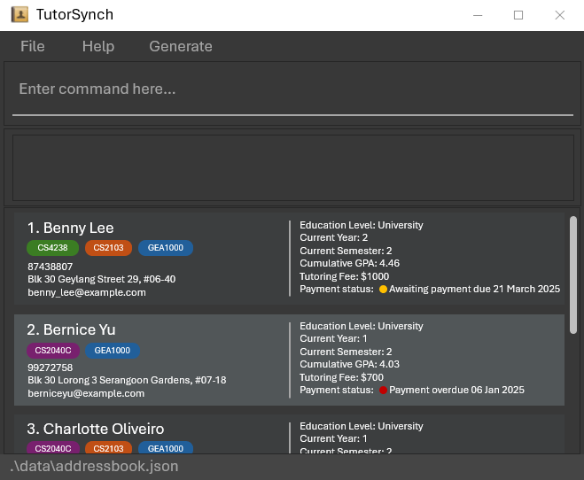
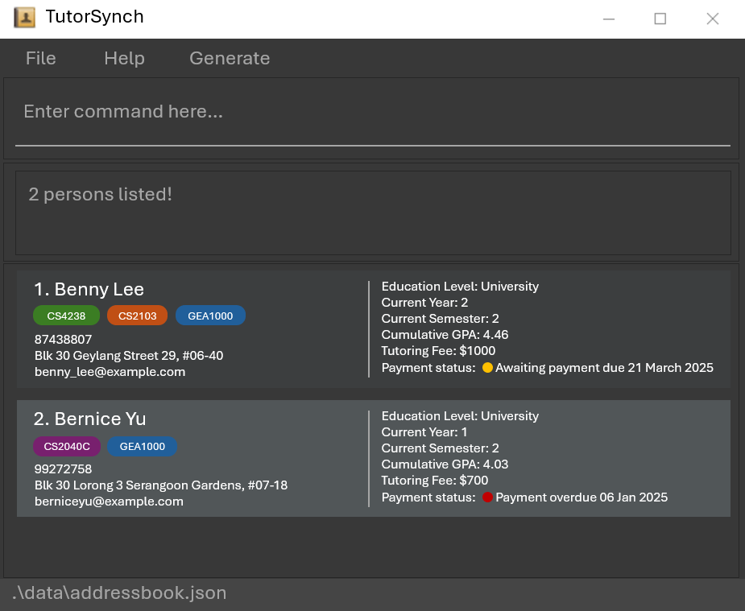

TutorSynch is a **desktop app for managing student contacts and academic details, optimized for use via a Command Line Interface** (CLI) while still having the benefits of a Graphical User Interface (GUI). If you can type fast, TutorSynch can get your contact management or other administrative tasks done faster than traditional GUI apps.

* Table of Contents
{:toc}

--------------------------------------------------------------------------------------------------------------------

## Quick start

1. Ensure you have Java `17` or above installed in your Computer. 
   **Mac users:** Ensure you have the precise JDK version prescribed [here](https://se-education.org/guides/tutorials/javaInstallationMac.html).

2. Download the latest `.jar` file from [here](https://github.com/AY2425S2-CS2103-F15-2/tp/releases).

3. Copy the file to the folder you want to use as the _home folder_ for your AddressBook.

4. Open a command terminal, `cd` into the folder you put the jar file in, and use the `java -jar addressbook.jar` command to run the application. 
   A GUI similar to the below should appear in a few seconds. Note how the app contains some sample data. 
   

5. Type the command in the command box and press Enter to execute it. e.g. typing **`help`** and pressing Enter will open the help window. 
   Some example commands you can try:

   * `list` : Lists all contacts.

   * `add n/John Doe p/98765432 e/johnd@example.com a/John street, block 123, #01-01` : Adds a contact named `John Doe` to the Address Book.

   * `delete 3` : Deletes the 3rd contact shown in the current list.

   * `purge` : Deletes all contacts.

   * `exit` : Exits the app.

6. Refer to the [Features](#features) below for details of each command.

--------------------------------------------------------------------------------------------------------------------

## Features

**:information_source: Notes about the command format:** 

* Words in `UPPER_CASE` are the parameters to be supplied by the user. 
  e.g. in `add n/NAME`, `NAME` is a parameter which can be used as `add n/John Doe`.

* Items in square brackets are optional. 
  e.g. `n/NAME [t/TAG]` can be used as `n/John Doe t/friend` or as `n/John Doe`.

* Items with `…` after them can be used less than or equals to 8 times, including zero times. 
  e.g. `[t/TAG]…` can be used as ` ` (i.e. 0 times), `t/cs4238`, `t/cs2103 t/GEA1000` etc.

* Any tags can be written as an alphanumeric tag, accompanied by `#` followed by 6 hexadecimal color code. (E.g. `CS2040C#ED9E49`)

* Parameters can be in any order. 
  e.g. if the command specifies `n/NAME p/PHONE_NUMBER`, `p/PHONE_NUMBER n/NAME` is also acceptable.

* Only use the prefixes explicitly defined for a given command. Using unsupported prefixes—such as those from other commands—may result in them being interpreted as plaintext (i.e. `f/1000` is not a valid prefix for the `add` command and will not be parsed correctly).

* Extraneous parameters for commands that do not take in parameters (such as `help`, `list`, `exit` and `purge`) will be ignored. 
  e.g. if the command specifies `help 123`, it will be interpreted as `help`.

* If you are using a PDF version of this document, be careful when copying and pasting commands that span multiple lines as space characters surrounding line-breaks may be omitted when copied over to the application.

:exclamation: **Constraints:** 

* NAME must be between 1 and 85 characters. (Do note that extremely long NAME may be truncated unless you increase the window size)

* EMAIL must be between 1 and 110 characters. (Do note that extremely long EMAIL may be truncated unless you increase the window size)

* ADDRESS must be between 1 and 110 characters. (Do note that extremely long ADDRESS may be truncated unless you increase the window size)

* CURRENT_YEAR must be between 1 and 30 characters.

* Each TAG (before the optional #HEX code) must be alphanumeric and at most 10 characters.

* Tags can include an optional hexadecimal color code in the format #RRGGBB (e.g., t/cs2040#FFAABB).

* A maximum of 8 unique TAGs is allowed per person.

* Parameters must conform to their respective formats and constraints; otherwise, the command may be rejected.

### Viewing help : `help`

Shows a message explaining how to access the help page. The help window will block any and all activity with the main window until it is closed.

Format: `help`

### Adding a person : `add`

Adds a person to the address book.

Format: `add n/NAME p/PHONE_NUMBER e/EMAIL a/ADDRESS [l/EDU_LEVEL] [cy/CURRENT_YEAR] [cg/CURRENT_GRADE] [eg/EXP_GRADE] [t/TAG]…​`

:bulb: **Tip:**
A person can have less than or equals to 8 unique tags each (including 0).

:bulb: **Tip:**
You can add a hexadecimal color code to any tag by appending `#RRGGBB` after the tag name.
For example: `t/CS2040#ED9E49`. This allows tags to be visually color-coded in the UI.

Examples:
* `add n/John Doe p/98765432 e/johnd@example.com a/John street, block 123, #01-01`
* `add n/Betsy Crowe t/friend e/betsycrowe@example.com a/Newgate Prison p/1234567 cg/C+ t/CS2030C`

### Listing all persons : `list`

Shows a list of all persons in the address book.

Format: `list`

### Editing a person : `edit`

Edits an existing person in the address book.

Format: `edit INDEX [n/NAME] [p/PHONE] [e/EMAIL] [a/ADDRESS] [l/EDU_LEVEL] [cy/CURRENT_YEAR] [cg/CURRENT_GRADE] [eg/EXP_GRADE] [t/TAG]… [t+/TAGS_TO_APPEND]… [t-/TAGS_TO_REMOVE]…`

* Edits the person at the specified `INDEX`. The index refers to the index number shown in the displayed person list. The index **must be a positive integer** 1, 2, 3, …​
* At least one of the optional fields must be provided.
* Existing values will be updated to the input values.

:bulb: **Tip:**
A person can have less than or equals to 8 unique tags each (including 0).

:bulb: **Tip:**
You can add a hexadecimal color code to any tag by appending `#RRGGBB` after the tag name.
For example: `t/CS2040#ED9E49`. This allows tags to be visually color-coded in the UI.

Examples:
*  `edit 1 p/91234567 e/johndoe@example.com` Edits the phone number and email address of the 1st person to be `91234567` and `johndoe@example.com` respectively.

#### Tag Editing : `t/`, `t+/`, `t-/`
* When editing tags, any number of `t/`, `t+/` or `t-/` may be provided, order of execution is as follows:
1. Tags prefixed with `t/` form the new list of tags (overwriting the old tags), if none are provided, old list of tags is used for the next steps.
2. Tags prefixed with `t+/` are added to the current list. If the tag already exists, the updated list remains unchanged as tags are unique.
3. Tags prefixed with `t-/` are removed from the list provided by the last step. If the tag to be removed does not exist, the app silently continues with the rest.
4. The final tag list is updated to the person, and should have less than or equals to 8 unique tags.

Examples:
*  `edit 2 n/Betsy Crower t/` Edits the name of the 2nd person to be `Betsy Crower` and clears all existing tags.
*  `edit 2 t-/Maths` Edits the tags of the 2nd person by removing `Maths` from existing list of tags.
*  `edit 1 t/Maths t/Science t-/Science ` Edits the tags of the 2nd person by clearing all existing tags and adding **only** `Maths`.
*  `edit 1 t+/friend t+/CS2030C#1E3BC3` appends `friend` and `CS2030C#1E3BC3` to existing tags (without overwriting or removing).

### Bulk removal of tags: `untag`

Removes **all occurrences** of the specified tags from **all student records**.

Format: `untag t/TAG [t/TAG]...`

- Removes all matching tags from all student records.
- If a tag does not exist in any student record, it will be ignored.

**Examples**:
- `untag t/Math`  
  Removes the tag `Math` from all student records.
- `untag t/Math t/Science`  
  Removes the tags `Math` and `Science` from all student records.

### Updating a person's payment information : `payment`

Updates the payment information of an existing person in the address book.

Format: `payment INDEX [f/FEE] [d/PAYMENT_DATE] [s/PAYMENT_STATUS]`

* Updates the person at the specified `INDEX`. The index refers to the index number shown in the displayed person list. The index **must be a positive integer** 1, 2, 3, …​
* Provided fields will be updated with the input values. Any missing fields will be removed by default.
* If none of the optional fields are provided, the specified person's payment information will be removed.
* `FEE` should be an unsigned integer (positive, no decimals, and less than or equal to $2,147,483,647), and will be removed if entered as `0`.
* `PAYMENT_DATE` should be in the format `DD-MM-YYYY`.
* `PAYMENT_STATUS` should be either `Paid` or `Waiting`.

Examples:
* `payment 1 f/1000 d/14-11-2000 s/paid` Updates the tutoring fee, payment date and status to be `1000`, `14-11-2000` and `paid` respectively.
* `payment 2` Removes the payment information of the 2nd person.

### Sorting the list of people : `sort`
Sorts the list of people alphabetically based on their name.

Subsequent additions are inserted at the bottom.

This command takes no arguments.

Format: `sort`

### Locating persons by name : `find`

Finds persons whose names contain any of the given keywords.

Format: `find KEYWORD [MORE_KEYWORDS]`

* The search is case-insensitive. e.g. `hans` will match `Hans`
* The order of the keywords does not matter. e.g. `Hans Bo` will match `Bo Hans`
* Only the name is searched.
* Only full words will be matched e.g. `Han` will not match `Hans`
* Persons matching at least one keyword will be returned (i.e. `OR` search).
  e.g. `Hans Bo` will return `Hans Gruber`, `Bo Yang`

Examples:
* `find John` returns `john` and `John Doe`
* `find lee yu` returns `Benny Lee`, `Bernice Yu` 
  

### Filter list of persons : `filter`

Filters list of persons who match all filter conditions.

Format: `filter [l/EDU_LEVEL] [cg/CURRENT_GRADE] [eg/EXP_GRADE] [t/TAG]…`

* Filters list to persons who fulfill all filter conditions.
* At least one of the optional fields must be provided.
* Empty fields are accepted
  * If `[l/EDU_LEVEL] [cg/CURRENT_GRADE] [eg/EXP_GRADE]` are empty e.g. `l/ cg/ eg/`,
    filter will show persons without values in respective fields stated.
  * `[t/TAG]…` an empty tag field will not add to filter condition.

### Deleting a person : `delete`

Deletes the specified person from the address book.

Format: `delete INDEX`

* Deletes the person at the specified `INDEX`.
* The index refers to the index number shown in the displayed person list.
* The index **must be a positive integer** 1, 2, 3, …​

Examples:
* `list` followed by `delete 2` deletes the 2nd person in the address book.
* `find Betsy` followed by `delete 1` deletes the 1st person in the results of the `find` command.

### Switching the Theme of the program : `toggletheme`

* Switches the theme of the program from Dark Mode to Light Mode or vice versa.
* Currently selected theme will be saved to the as a User Preferance Setting and loaded upon next boot.

Format: `toggletheme`

### Deleting multiple persons : `clear`

Deletes multiple persons:
* in sequence from a starting to ending index **OR**
* based on given tags (person is deleted if they have at least one of the provided tags).

Format: `clear i/START_INDEX...END_INDEX` OR `clear t/TAG [t/TAG]...`
* Index refers to the index number shown in the displayed person list.
* Indices must be **positive integers** 1, 2, 3, ...
* Starting index must be **strictly smaller** than ending index.
* Tags provided must be valid tags (color code not necessary) in the format prescribed above.
* At least one tag must be provided.
* Each person in the address book is checked for the tags provided.
* If the person has at least one tag that matches, they will be deleted.
* **IMPORTANT**: using both types of prefixes together will yield an error.

Examples:
* `list` followed by `clear i/2...5` will delete persons at indices 2, 3, 4 and 5 for a total of four deletions.
* `clear t/friends t/enemies` will delete persons who have either the `friends` tag or `enemeies` tag.

### Purging all entries : `purge`

Purges all entries from the address book.

Format: `purge`

### Exiting the program : `exit`

Exits the program.

Format: `exit`

### Saving the data

TutorSynch data are saved in the hard disk automatically after any command that changes the data. There is no need to save manually.

### Editing the data file

TutorSynch data are saved automatically as a JSON file `[JAR file location]/data/addressbook.json`. Advanced users are welcome to update data directly by editing that data file.

:exclamation: **Caution:**
If your changes to the data file makes its format invalid, TutorSynch will discard all data and start with an empty data file at the next run. Hence, it is recommended to take a backup of the file before editing it. 
Furthermore, certain edits can cause the TutorSynch to behave in unexpected ways (e.g., if a value entered is outside the acceptable range). Therefore, edit the data file only if you are confident that you can update it correctly.

--------------------------------------------------------------------------------------------------------------------

## FAQ

**Q**: How do I transfer my data to another Computer? 
**A**: Install the app on the other computer. After it runs once, it will create a default data file at `[JAR file location]/data/addressbook.json`. To transfer your data, overwrite this file with the `addressbook.json` file from your original computer.

:exclamation: **Caution:**
Before doing this, ensure that the data file is valid and has not been corrupted or manually edited in a way that breaks the expected format. Invalid or out-of-range values may cause TutorSynch to start with an empty data file or behave unpredictably. 
It's strongly recommended to make a backup of your data file before any manual edits or transfers.

--------------------------------------------------------------------------------------------------------------------

## Known issues

1. **When using multiple screens**, if you move the application to a secondary screen, and later switch to using only the primary screen, the GUI will open off-screen. The remedy is to delete the `preferences.json` file created by the application before running the application again.
2. **If you need to see your truncated NAME, EMAIL or ADDRESS**, increase your window size for the application until it is no longer truncated.

--------------------------------------------------------------------------------------------------------------------

## Command summary

| Action           | Format, Examples                                                                                                                                                                                                                                       |
|------------------|--------------------------------------------------------------------------------------------------------------------------------------------------------------------------------------------------------------------------------------------------------|
| **Add**          | `add n/NAME p/PHONE_NUMBER e/EMAIL a/ADDRESS [l/ EDUCATION_LEVEL] [cy/CURRENT_YEAR] [cg/CURRENT_GRADE] [eg/EXPECTED_GRADE] [t/TAG]…`   e.g., `add n/James Ho p/22224444 e/jamesho@example.com a/123, Clementi Rd, 1234665 cg/D t/CS2030C t/friends` |
| **Purge**        | `purge`                                                                                                                                                                                                                                                |
| **Delete**       | `delete INDEX`  e.g., `delete 3`                                                                                                                                                                                                                    |
| **Clear**        | `clear i/START_INDEX...END_INDEX` OR `clear t/TAG [t/TAG]`                                                                                                                                                                                             |
| **Edit**         | `edit INDEX [n/NAME] [p/PHONE_NUMBER] [e/EMAIL] [a/ADDRESS] [cy/CURRENT_YEAR] [cg/CURRENT_GRADE] [eg/EXPECTED_GRADE] [t/TAG]… [t+/TAGS_TO_APPEND]… [t-/TAGS_TO_REMOVE]…`  e.g.,`edit 2 n/James Lee e/jameslee@example.com t+/CS2040C#1E2C4D`        |
| **Untag**        | `untag t/TAG [t/TAG]...`  e.g., `untag t/Math t/Science`                                                                                                                                                                                            |
| **Payment**      | `payment INDEX [f/FEE] [d/PAYMENT_DATE] [s/PAYMENT_STATUS]`  e.g., `payment 1 f/1000 d/14-11-2000 s/paid`                                                                                                                                           |
| **Find**         | `find KEYWORD [MORE_KEYWORDS]`  e.g., `find James Jake`                                                                                                                                                                                             |
| **Sort**         | `sort`                                                                                                                                                                                                                                                 |
| **Filter**       | `filter [l/EDU_LEVEL] [cg/CURRENT_GRADE] [eg/EXP_GRADE] [t/TAG]…`                                                                                                                                                                                      |
| **List**         | `list`                                                                                                                                                                                                                                                 |
| **Help**         | `help`                                                                                                                                                                                                                                                 |
| **Switch Theme** | `toggletheme`                                                                                                                                                                                                                                          |
| **Exit**         | `exit`                                                                                                                                                                                                                                                 |
